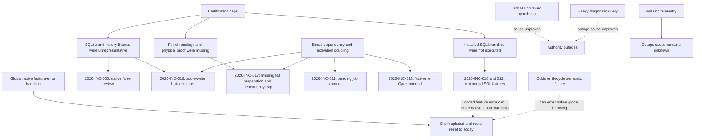

# Root-cause tree and shared versus independent failures

## Ranked systemic contributors (overlapping incident counts)

1. **Proof-layer and chronological certification gaps** (`2026-INC-001` through `014`, `016` through `019`, `021`, and `024`): many isolated components passed without the required real SQL, persisted timestamp, deployment configuration, chronological dependency, historical-volume, or physical proof. This is a shared escape mechanism, not the immediate cause of every bug.
2. **Lifecycle/dependency coupling and hidden state** (`2026-INC-011`, `013`, `016`, `017`, `019`, plus `009`): exact activation binding, broad hashes, and invisible current jobs transformed safe guards into operational traps.
3. **Native feature/session/navigation coupling** (`2026-INC-007`, `008`, and `009`, plus the consequence of a coded feature 503): an optional feature error could drive global revalidation and shell replacement. The server failure, native handling, and Today reset are separate causal steps. Physical attribution to a particular request remains UNKNOWN where correlated device evidence is absent.
4. **Unbounded historical work on live paths or missing resource proof** (`2026-INC-019` proven; `023` diagnostic risk proven; `022` and `024` mechanisms UNKNOWN): critical work and diagnostics shared resource budget without measured capacity or admission.
5. **Operational recovery not productized** (`2026-INC-014`, `016` through `021`, and `025`): the owner relied on engineering for routine status, dependency clearance, and physical entry.

Counts are thematic mappings, not statistically independent incidents or measured frequency. One physical event can have multiple contributing causes.

| Category | Proven failures / secondary cause | Symptoms / downstream effect | Preventive control |
|---|---|---|---|
| Native architecture | Noncanonical `Date` persistence equality; global shell ownership | Needs Review; route reset to Today | Formal serialization, state, and error ownership; `NA-2026-006` and `NA-2026-007` physical persistence/lifecycle tests |
| Backend application | Missing PWA configuration; semantic bounds | Route 503; invalid presentation | Hosted configuration contract; capability tests |
| PostgreSQL / SQL | Qualified special expressions | SQL `42883` during claim/read | Execute installed functions and apply static lint |
| Database performance | Historical Calcutta fingerprint in score transaction | SQL `57014` rollback | Bounded path, minimal outbox, and growth plans |
| Infrastructure / capacity | Warning and connection outages observed; exact cause UNKNOWN | Authority 503 | Retained metrics, headroom evidence, and failure drills |
| Release / activation | First-write activation increment; pending job exact binding | Open rollback; stranded job | Compatible version contract and crossing tests |
| State / lifecycle | Setup success did not prove preparation; stale Odds | Future round blocked | Self-certifying operations and a semantic dependency graph |
| Director / operations | Generic blockers and hidden receipts | Codex/Terminal burden | Next Safe Action, status, and supported recovery |
| Side-game architecture | Broad cross-domain hash; current/history conflation | Compatibility trap and latency | Narrow inputs and explicit lifecycle |
| Testing / certification | Wrong layer, fixture, sequence, or volume | False broad confidence | Required proof matrix and evidence expiration |
| Physical validation | No complete all-format, persisted, multi-hole field proof | First play exposed issues | Multi-user device/network rehearsal |
| Observability | Missing request/resource correlation | Unknown cause and slow diagnosis | Correlation IDs and durable metrics |
| Diagnostic tooling | Heavy history query on the live primary | Resource risk | Enforced read budget or an isolated clone |
| Operator workflow | Hidden order and unknown outcome | Repeated manual coordination | Productized runbooks and receipts |

The SQL qualification, missing signing key, `Date` precision, window appearance, and Odds numeric-bound incidents have independent immediate causes. Larger compute cannot fix those correctness defects. Conversely, a correct local patch does not remove the shared certification weakness.

## Stable root-cause identifiers

| Incident | Root cause ID |
|---|---|
| 2026-INC-001 | RC-TIME |
| 2026-INC-002 | RC-NAV-CONTRACT |
| 2026-INC-003 | RC-APPEARANCE-FIXTURE |
| 2026-INC-004 | RC-TODAY-STATE |
| 2026-INC-005 | RC-SCORE-PROJECTION |
| 2026-INC-006 | RC-PERSISTENCE |
| 2026-INC-007 | RC-SHELL-COUPLING |
| 2026-INC-008 | RC-SEMANTIC-BOUNDS |
| 2026-INC-009 | RC-LIFECYCLE |
| 2026-INC-010 | RC-SQL-EXECUTION |
| 2026-INC-011 | RC-ACTIVATION |
| 2026-INC-012 | RC-SQL-EXECUTION |
| 2026-INC-013 | RC-ACTIVATION |
| 2026-INC-014 | RC-CONFIG |
| 2026-INC-015 | RC-UNKNOWN-SW |
| 2026-INC-016 | RC-DEPENDENCY |
| 2026-INC-017 | RC-PREPARATION-WORKFLOW |
| 2026-INC-018 | RC-UNKNOWN-OUTCOME |
| 2026-INC-019 | RC-HISTORY-CRITICAL-PATH |
| 2026-INC-020 | RC-RECOVERY-UX |
| 2026-INC-021 | RC-FINANCIAL-UX |
| 2026-INC-022 | RC-UNKNOWN-DB |
| 2026-INC-023 | RC-UNKNOWN-DB |
| 2026-INC-024 | RC-CAPACITY-PROOF |
| 2026-INC-025 | RC-OBSERVABILITY |
| 2026-INC-026 | RC-UNKNOWN-NETWORK |
