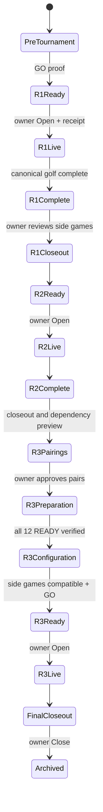

# Tournament Operations engine

**Audit boundary:** historical evidence and source review only. No Production/staging requests, mutations, builds, deployments or source changes in this audit. Proposed designs are not implemented or approved release evidence. Unknown measurements remain unknown.

**Recommendation, HIGH CONFIDENCE:** use one bounded orchestration/read model alongside existing canonical authority, not another scoring authority or a distributed microservice rewrite. Incidents 016–018 expose hidden sequencing and absent prepared contexts.

Inputs: current setup/round/matches, pairings, approved handicap, prepared contexts, scoped counts, Net Skins/Odds/Calcutta current pointers, exact unresolved operation, release lock and fresh health. Outputs: phase, completed requirements, outstanding requirements, blockers, allowed operations and next safe action. Each blocker states the exact protected fact, owning operation, revision and supported clearance.

Optional side games do not secretly gate golf unless an exact competitive dependency genuinely requires it. A waiver is explicit, auditable and cannot rewrite side-game membership or canonical golf. The engine can recommend parallel optional work while preserving mandatory prerequisites.

The R3 proposed sequence is R2 canonical closeout → identify obsolete Odds and publication dependencies → approved supported clearance → pairings → whole-round preparation → 12/12 READY readback → configure R3 side games → review/publication → morning GO → owner Open. The exact installed 2026 flow required engineering recovery after side games were bound too early; do not present this proposed automation as already available.

The state machine advances on canonical receipts/events, never button taps. Every phase keeps original operation identity through unknown outcomes. Owner dashboard can be a single mobile screen with drill-down, not dozens of raw revision values.

Acceptance: owner completes synthetic R1→R2→R3→archive using Director only; stale Odds, preparation denial and unknown Open injections are resolved through the UI without Codex/Terminal. Test CERT-SYN-001 / CERT-PHY-001.
