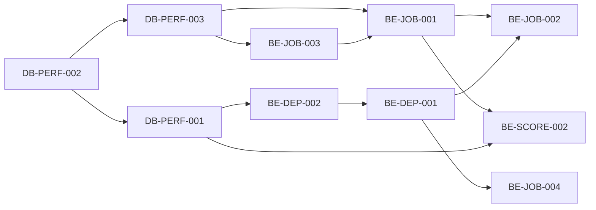
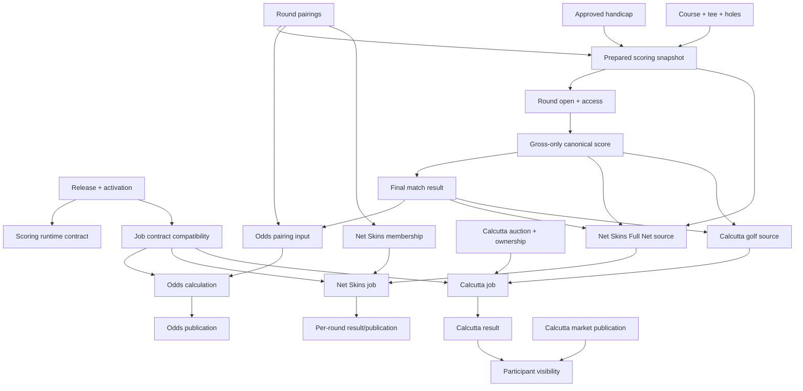

# Dependency graph redesign

## What 2026 exposed

The system had valid local guards but no single operator-visible graph of why one action depended on another. As a result:

- a stale unpublished Odds calculation blocked withdrawal and R3 pairing;
- pairing succeeded without preparing scoring contexts;
- Net Skins, Odds and Calcutta became blockers before the missing preparation was discovered;
- a broad Calcutta compatibility hash changed because Net Skins history/current metadata changed, although Calcutta financial and completed-golf facts had not;
- exact activation protected jobs but normal release advancement stranded an already-pending one.

These were not reasons to remove guards. They were reasons to make the graph explicit, semantic and versioned.

## Implementation prerequisites

The 2027 requirement catalog distinguishes true implementation prerequisites from mutual contract coordination. The `dependencies` graph is a DAG:



`integrationDependencies` retains the reciprocal coordination between event and worker, event and score transaction, receipt and current pointer, semantic manifest and bounded history plan, and release-job and compatibility contracts. Coordination does not create a reverse prerequisite.

## Required graph



Each edge has four fields:

| Field | Meaning |
|---|---|
| Producer contract | Named semantic version of the upstream data |
| Consumer acceptance | Accepted versions and fields actually consumed |
| Freshness | Exact source revision/component digests used by the consumer |
| Recovery | Supported action when incompatible, including visibility/history effects |

## Compatibility contract

An edge is compatible when all of the following hold:

1. The producer identity and scope match.
2. The producer contract version is explicitly accepted.
3. All consumed semantic components match or a named transition proves the difference neutral.
4. Release/activation/job authority is current or an exact audited carry-forward exists.
5. Current pointer and publication references are internally consistent.

Compatibility never means ignoring activation, comparing only a top-level revision, or recomputing a broad hash until it happens to match.

## Action planning

Before a Director action, the backend returns a dependency plan:

```json
{
  "action": "PREPARE_ROUND",
  "target": "2026:R3",
  "allowed": false,
  "blockers": [
    {
      "domain": "ODDS_PUBLICATION",
      "state": "PUBLISHED_CURRENT",
      "reason": "Current public snapshot contains the pre-change pairing authority.",
      "supportedAction": "WITHDRAW_PUBLICATION",
      "historyPreserved": true,
      "publicVisibilityChanges": true
    }
  ]
}
```

The real response would list every blocker at once. It must distinguish an active job, stale READY job, current publication, configured membership, historical result and incompatible semantic input. The UI should not require the operator to clear the first blocker only to discover the next one.

## Round state machine

`UNPAIRED → PAIRED_UNPREPARED → READY → LIVE → FINAL` is the visible server state. Pairing receipt `snapshotPrepared:false` must result in `PAIRED_UNPREPARED`, never a generic success presentation implying readiness. Side-game compatibility is evaluated before the transition that would create a trap.

For late changes, the server plans the full sequence before the first mutation:

1. Inventory current publications/jobs/results and their semantic inputs.
2. Classify each dependency as unaffected, compatible transition, must withdraw/supersede, or impossible.
3. Present all public-visibility and financial consequences.
4. Execute each authorized transition with a receipt.
5. Prepare contexts atomically when the backend advertises whole-round atomicity.
6. Re-evaluate graph and return the final READY evidence.

## Evidence

- Incident 016 blocker graph: `/private/tmp/bagger-r3-pairing-blocker/REPORT.md:60-90`.
- Incident 017 0/12 state and four dependency codes: `/private/tmp/bagger-r3-readiness-recovery/REPORT.md:28-115`.
- Broad-hash difference isolated to Net Skins history/current metadata: `/private/tmp/bagger-r3-dependency-recovery/REPORT.md:65-77`.
- Activation/job mismatch: `/private/tmp/bagger-calcutta-processor-repair/REPORT.md:82-109`.

## Acceptance

`NA-2026-017` proves contract-version compatibility without guard bypass and drives pair, prepare, open and dependency changes through the full state machine. `NA-2026-016` proves each side-game blocking state has a safe supported action or an explicit stop.
