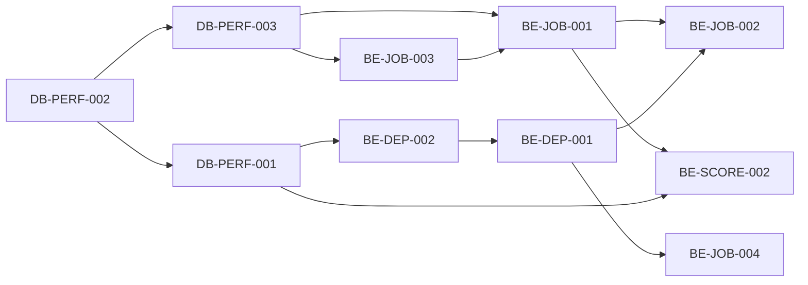

# Backend roadmap

## Planning basis

This roadmap starts from the exact Release 139 candidate at SHA `b2065c901f9f6cbdc3dc2f1f37f6b1b782309ec6`. It orders proposed work from the 2026 evidence; it does not describe features already present. The confidence attached to each proposal is confidence in the recommendation, supported by proven incident evidence, rather than proof that the proposed implementation works.

Numeric latency values are provisional design targets. The infrastructure-owned 2027 performance work must establish the production-shaped baseline, contention envelope and release budget before those values become gates.

### Requirement prerequisite order

`dependencies` is an acyclic implementation order. Reciprocal contract design is recorded separately as `integrationDependencies`; it does not reverse the build order.

The integration pairs are event/worker, event/score transaction, receipt/current-pointer, semantic manifest/history plan, and release-job/compatibility contract. Their APIs are designed together, but the arrows above remain the implementation prerequisites.

## P0: protect canonical scoring and recoverability

### Critical transaction boundary

Build `DB-PERF-002`, `DB-PERF-003`, `BE-JOB-003`, `DB-PERF-001` and `BE-JOB-001` in prerequisite order, then deliver `BE-SCORE-001` and `BE-SCORE-002` against those foundations as one reviewable scoring release group.

- Keep every writable client server-gross-only.
- Restrict the score transaction to authority, idempotency, canonical calculation, canonical writes, receipt/audit and a minimal transactional event.
- Move Calcutta, Net Skins, Odds, intelligence and external projection work to independent consumers of committed events.
- Execute every installed PostgreSQL function and reachable branch in the supported database major version.
- Reject unbounded history aggregation from every score/match trigger path.

The completion gate is `NA-2026-019` plus the real-database cases in `NA-2026-010` and `NA-2026-012`. The first benchmark records the production-shaped baseline. Align provisional targets with the infrastructure-owned budget: SQL/RPC transaction p95 at or below 1 second and p99 at or below 2 seconds; end-to-end score mutation p95 at or below 2 seconds and p99 at or below 4 seconds. These become release gates only after measurement on matched tournament compute.

### Unknown outcomes and physical fallback

Deliver `BE-SCORE-003` and `BE-SCORE-004` on the `BE-JOB-003` receipt foundation with the root recovery requirement `DIR-REC-001`.

- Persist a receipt for every round, match, hole and job operation.
- Reconcile receipt and canonical state before retry after a timeout or lost response.
- Add a supported physical-card workflow that reads each hole freshly, skips exact matches, stops on conflicts and writes absent gross values with durable mutation IDs.
- Require a final report with written, skipped, conflict, unknown and overwritten counts.

This is P0 because Incident 020 proved tournament completion can depend on physical evidence when the ordinary writable path is incomplete. The 2026 recovery was safe and lossless, but it was an incident procedure rather than a supported product capability. The gate is `NA-2026-018` and `NA-2026-020` on physical devices.

## P0: make derived work durable and explainable

Deliver `BE-JOB-002`, `BE-DEP-001`, `BE-DEP-002` and `BE-DEP-003` after the minimal event contract is stable.

- Separate job execution status, source freshness, calculation readiness and publication visibility.
- Give every worker bounded leases, deterministic retry classification and compare-and-swap completion.
- Replace broad history fingerprints with versioned manifests of semantic fields.
- Model Pair, Prepare and Open as durable states with explicit prerequisites and receipts.
- Return a dependency plan that names the blocking producer, changed semantic components and supported recovery.

Activation and dependency guards remain exact. Compatibility is granted only by a named contract-version rule that proves the change neutral for that consumer. The gates are `NA-2026-011`, `NA-2026-016` and `NA-2026-017`.

## P0: release and environment admission

Deliver `BE-JOB-005` in the release pipeline.

- Declare required secrets and route-specific checks by target environment without exposing values.
- Prove the scoring-session handshake after the Production rebind and before tournament traffic.
- Record the service-worker active/waiting version on the installed PWA.
- Block promotion when a required job disposition or environment dependency is unknown.

Incident 014 proves the Production signing key gap. Incident 015 remains root-cause `UNKNOWN` because the affected phone's worker state was never captured. The gate is `NA-2026-014` and `NA-2026-015`; success must not recast the unknown 2026 cause as proven.

## P1: simplify state and correction operations

Deliver `BE-JOB-004`, `BE-DEP-004` and `BE-DEP-005` after the P0 pointer, receipt and compatibility primitives exist.

- Replace duplicated scalar/current-row truth with one constrained pointer to an immutable revision.
- Add explicit release-to-job disposition and compatible carry-forward.
- Give each publication/calculation blocker a typed state and one supported action.
- Certify post-completion Calcutta ownership correction as immutable revision replacement.

The Calcutta correction fixture is the historical read-only snapshot captured at `2026-09-27T12:26:41.188212Z`: configuration 2, auction 37, publication 41 `PUBLISHED`, result 424 `OFFICIAL`, 24 purchases totaling $18,500 and all 24 golfers final. It is not a statement about later live state. The correction gate must compare every purchase, allocation and price, preserve golf, and prove participant visibility transitions.

## Sequencing and release units

| Release unit | Depends on | Reviewable output | Exit evidence |
|---|---|---|---|
| A. Database execution certification | existing schema inventory | PostgreSQL branch matrix and installed-definition check (`DB-PERF-002`) | 42883 fixtures fail before the fix and pass after it |
| B. State foundations | A | constrained current pointers (`DB-PERF-003`) and bounded live-path plans (`DB-PERF-001`) | reconciliation query and history-scale plan evidence |
| C. Receipts and semantic manifests | B | immutable receipts (`BE-JOB-003`) and semantic manifests (`BE-DEP-002`) | unknown-response drill and component-delta proof |
| D. Compatibility and event seam | B, C | compatibility contracts (`BE-DEP-001`) and minimal event (`BE-JOB-001`) | rollback/commit coupling and exact compatibility cases |
| E. Score boundary and durable consumers | D | bounded scoring (`BE-SCORE-002`) and independent workers (`BE-JOB-002`) | latency, pause, replay, duplicate and two-worker evidence |
| F. Recovery and setup orchestration | C-E | physical-card recovery and setup state machine | physical conflict drill and R3 late-round fixtures |
| G. Release and correction operations | C-F | release-job transition, typed blockers and immutable correction | job disposition and Calcutta correction drills |
| H. Promotion admission | A-G | secret, worker-version and job-disposition gates | installed-PWA and route handshake evidence |

Do not combine units B through G into one migration. The event seam must be observable before consumers move, and receipts must exist before recovery depends on them.

## Evidence and limits

- Score timeout and late-R3 planner behavior: `/private/tmp/bagger-r3-write-timeout/REPORT.md:41-119` and `supabase/production_migrations/202609270120_bounded_late_r3_result_compatibility_v1.sql:3-31`.
- Installed SQL failures: `/private/tmp/bagger-calcutta-processor-incident/REPORT.md:63-118` and `/private/tmp/bagger-net-skins-incident/REPORT.md:52-83`.
- Activation-stranded job: `/private/tmp/bagger-calcutta-processor-repair/REPORT.md:82-109`.
- R3 dependency and preparation failures: `/private/tmp/bagger-r3-readiness-recovery/REPORT.md:30-106` and `/private/tmp/bagger-r3-dependency-recovery/REPORT.md:41-120`.
- Physical recovery: `/private/tmp/bagger-r3-physical-recovery139/REPORT.md:32-97` and `FINAL-SUMMARY.json`.
- Historical Calcutta correction fixture: `/private/tmp/bagger-calcutta-ownership-readonly/REPORT.md` and `current.json`.

Exact requirement acceptance, physical-device checks, assumptions and risks are in `working/backend-requirements.json`.
