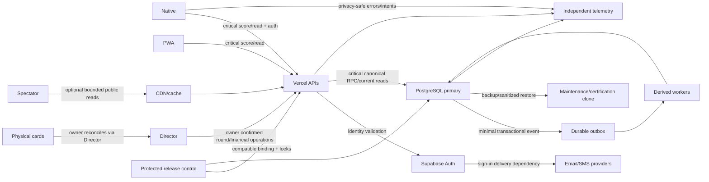

# Service and authority dependency map

PostgreSQL and API availability are single critical digital-scoring dependencies; PWA does not protect against a shared backend outage. Existing authenticated session continuity during providerauthoutage needs explicit contract proof. Email/SMS is critical for new sign-in, should not become synchronous dependency for every score. Exact2026providerconfiguration beyond evidence is UNKNOWN.

Target simplicity: retain one PostgreSQLcanonicalauthority, existingVercelAPI, modestdurablejob/outboxseam, boundedpubliccache, independentmetrics, isolatedcertificationclone and first-classDirector. No need for microservices, broad event-sourcing rewrite or multiregiondistributedfinancialsystem at24-playerannualscale. Reevaluate on measured multi-tournamentconcurrency, sustainedresource/budgetlimits or availabilityrequirements.

See [critical paths](65-CRITICAL-PATH-DIAGRAMS.md), [native architecture](25-NATIVE-NAVIGATION.md), [infrastructure](INFRASTRUCTURE-BLUEPRINT.md). Diagrams are proposedtarget except explicitly cited2026dependencies.
