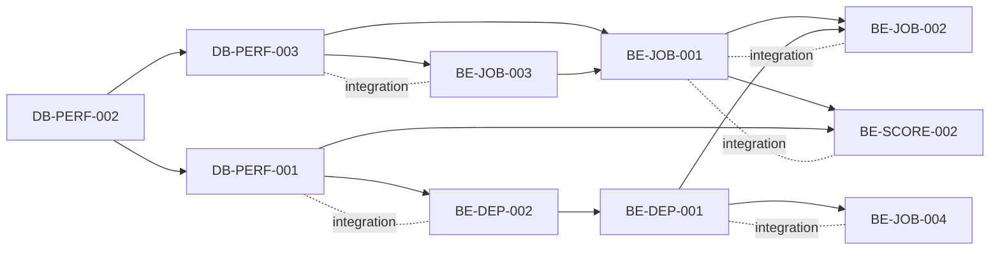
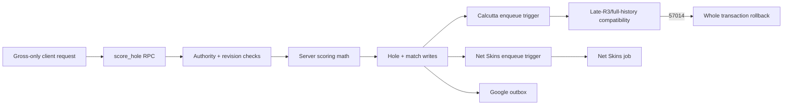
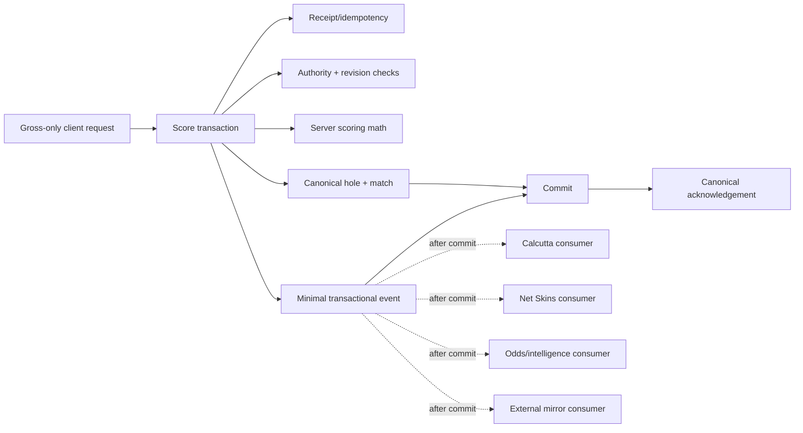
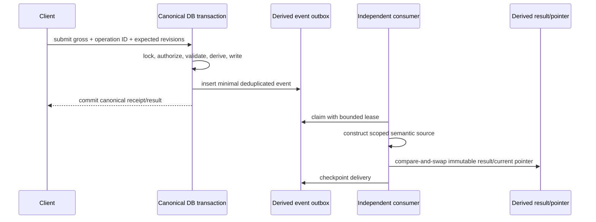
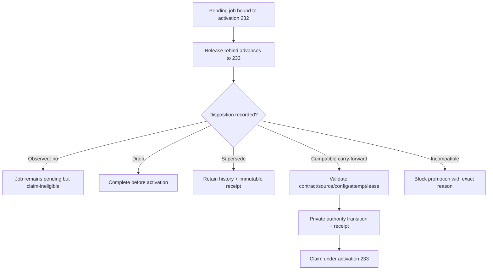
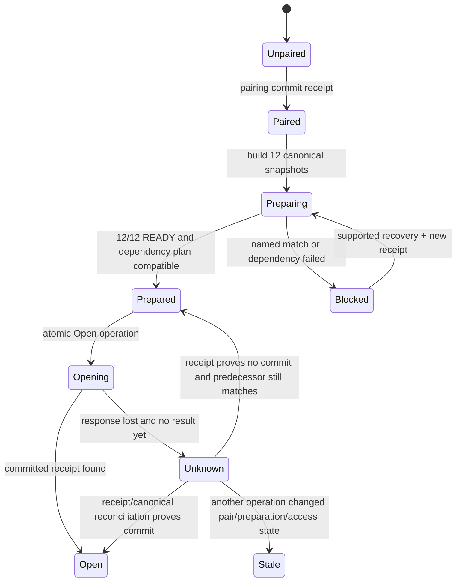
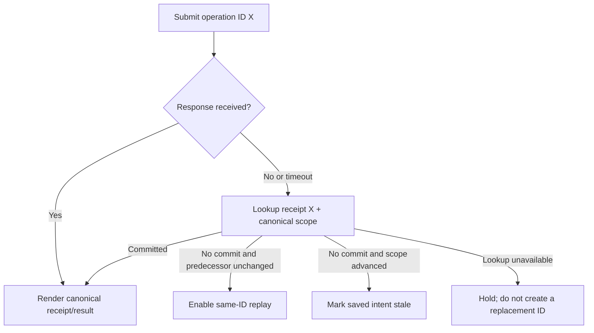
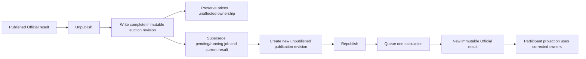

# Critical-path diagrams

These diagrams distinguish observed Release 139 behavior from the proposed 2027 architecture. They are design aids, not evidence that the proposed components exist.

## 0. Proposed implementation prerequisite DAG

Solid arrows are true prerequisites. Dashed lines are integration contracts designed jointly; they do not reverse the prerequisite arrows.

## 1. Score write: observed and proposed

Observed at the pinned candidate, score and match mutations synchronously reach Calcutta and Net Skins enqueue triggers. Incident 019 showed a Calcutta compatibility predicate could reach broad historical fingerprints and time out the entire score transaction.

Proposed, the score transaction performs only bounded canonical work and writes one minimal committed event. Independent consumers can fail or pause without rolling back golf.

The unified derived-state event is proposed. The existing Google outbox and post-commit consumers are useful prior art, but they do not prove this architecture is implemented.

## 2. Transactional event and durable consumers

A rollback removes both canonical mutation and event. A consumer retry uses the same event/delivery identity and cannot republish stale input.

## 3. Release advancement and retained jobs

Incident 011 followed the left-hand path. The right-hand path is the proposed contract.

Exact activation guards stay in place. A compatible transition changes authority through a recorded operation; consumers never ignore expected activation.

## 4. R3 pair, prepare and open

Incident 017 had 12 pairings but 0/12 prepared snapshots. Pairing success must therefore never render as ready. Incident 018 also shows that an unknown whole-round Open cannot be retried after separate per-match operations changed state.

## 5. Unknown mutation outcome

## 6. Calcutta ownership correction

The workflow below is supported by the pinned candidate's source. It must be certified end to end before routine tournament use.

The reference fixture is only the read-only snapshot at `2026-09-27T12:26:41.188212Z`: auction revision 37, publication 41, result 424, 24 purchases totaling $18,500, and all 24 golfers final. It is historical, not a current-live assertion.

## Source anchors

- Gross-only scoring transaction: `contracts/mobile/v1/scoring-hole-request.schema.json:11-12` and `supabase/production_migrations/202608240021_production_scoring_operations.sql:931-1145`.
- Calcutta synchronous triggers: `supabase/production_migrations/202608290056_production_calcutta_v1.sql:1529-1615`.
- Net Skins synchronous triggers: `supabase/production_migrations/202608290055_production_net_skins_v1.sql:1138-1213`.
- Existing score Google outbox: `supabase/production_migrations/202608240021_production_scoring_operations.sql:1138-1144`.
- Calcutta replace/publish/unpublish paths: `supabase/production_migrations/202608290056_production_calcutta_v1.sql:1033-1178`, `:1698-1858` and `:1867-2010`.
- Incident evidence: `/private/tmp/bagger-calcutta-processor-repair/REPORT.md`, `/private/tmp/bagger-r3-readiness-recovery/REPORT.md`, `/private/tmp/bagger-r3-open-outcome/REPORT.md`, `/private/tmp/bagger-r3-write-timeout/REPORT.md` and `/private/tmp/bagger-calcutta-ownership-readonly/REPORT.md`.
