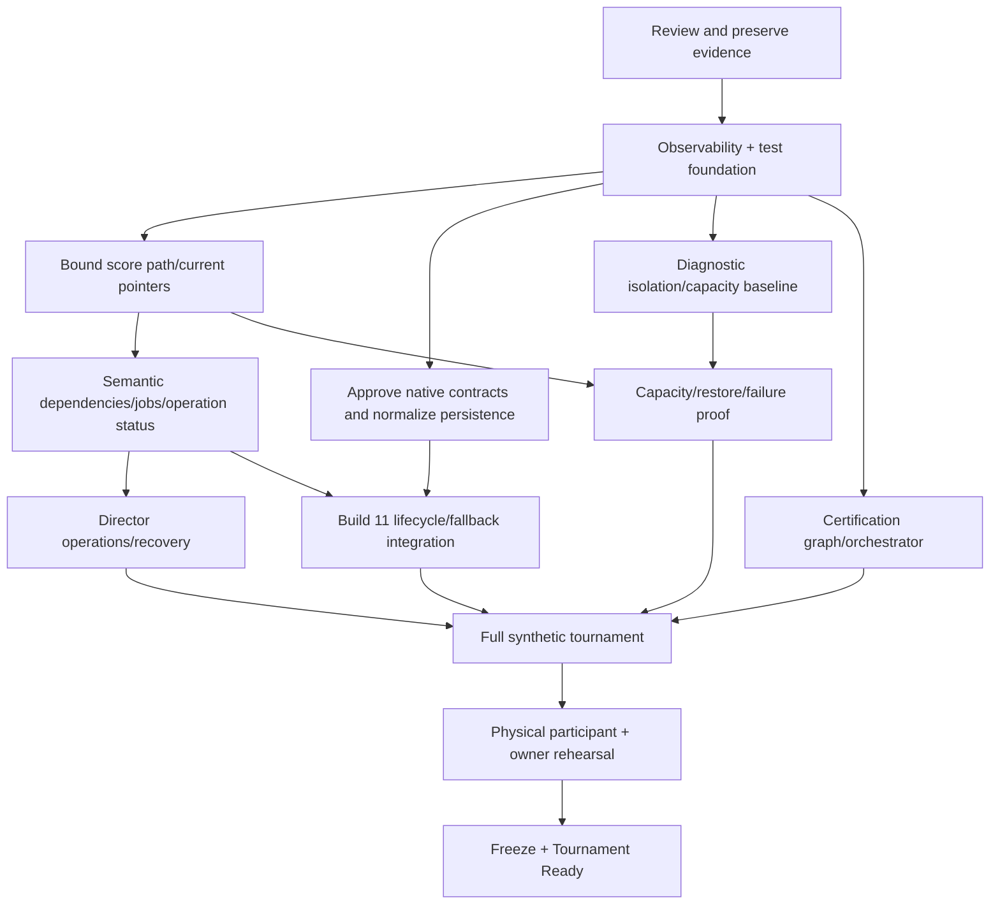

# Authoritative implementation sequence and parallel work

## PH0 — Preserve and review evidence

**Work:** Approve the postmortem, unknowns, P0 scope and durable retention. **Dependencies:** None. **Exit:** Sanitized manifest and agreed requirements. **Relative effort:** S.

## PH1 — Observability and test foundation

**Work:** Correlation, typed health and provider export; real SQL/SQLite Never Again and benchmark harness. **Dependencies:** PH0. **Exit:** Exact failures are traceable and reproducible, with no secrets. **Relative effort:** L.

## PH2 — Critical backend/database

**Work:** Bound the score transaction; add current pointers, outbox, query/permission/plan guards and diagnostic admission. **Dependencies:** PH1. **Exit:** Correctness, rollback and idempotency plus a measured history-scale budget. **Relative effort:** L.

## PH3 — Lifecycle and dependencies

**Work:** Narrow semantic components, current/history, job compatibility/supersession and exact operation status. **Dependencies:** PH1; PH2 scoring seam for derived consumers. **Exit:** Full side-game and R3 chronology passes in isolation. **Relative effort:** L.

## PH4 — Director operations

**Work:** GO, Prepare, Open, readback, receipts, closeout, blockers, physical recovery and mobile UX. **Dependencies:** PH3 contract; can prototype from the approved PH1 contract. **Exit:** The owner synthetic flow requires no SQL or Codex. **Relative effort:** L.

## PH5 — Build 11 reliability

**Work:** Separate shell, session and errors; normalize the queue; add all-format reconciliation and typed lifecycle/fallback telemetry. **Dependencies:** Approved PH1/PH3 contracts; queue serialization work can run early in parallel. **Exit:** Engineering exit criteria; no P0 native defects. **Relative effort:** L.

## PH6 — Automation and certification

**Work:** Impact graph, test selection, claim generator, invariant monitors and freeze gates. **Dependencies:** The PH1 foundation grows continuously; final integration follows PH3–PH5. **Exit:** Missing required proof blocks freeze automatically. **Relative effort:** L.

## PH7 — Capacity and disaster readiness

**Work:** Matched compute and pools, soak/growth/failure/restore, maintenance clone and telemetry retention. **Dependencies:** PH2 bounded paths and PH1 metrics. **Exit:** Budgets, headroom, restore and fallback evidence. **Relative effort:** M/L.

## PH8 — Full synthetic tournament

**Work:** 24 golfers, spectators, all 54 holes, side-game chronology and failures. **Dependencies:** PH2–PH7. **Exit:** Every critical lifecycle capability passes. **Relative effort:** L.

## PH9 — Physical and owner tournament

**Work:** Two phones, accounts and radios; beta; owner incidents; scorecard drill. **Dependencies:** PH8 on the frozen candidate. **Exit:** Physical and owner proof complete; zero routine engineering. **Relative effort:** L.

## PH10 — 2027 freeze

**Work:** Exact artifacts, known limitations, rollback and GO readiness. **Dependencies:** PH9. **Exit:** Tournament Ready evidence conjunction; no hidden P0 gaps. **Relative effort:** M.

Shortest responsible Build 11 path: approved error, navigation and persistence contracts → isolated queue/navigation implementation plus tests → versioned backend lifecycle, allocation and fallback contracts → integration and release build → physical all-format and recovery proof → full tournament and owner rehearsal for tournament certification. Queue normalization does not need to wait for all Director work. No full rewrite is required.

The critical path to 2027 extends beyond shipping Build 11: backend, Director, capacity, fallback automation and chronological physical rehearsal all remain mandatory. Work packages are relative estimates, not calendar commitments; one-owner staffing and provider access may extend the duration.

