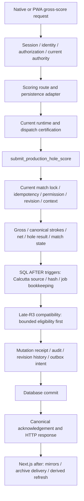

# Score critical-path baseline

## Scope and evidence

This document records the Release 139 scoring call graph at Git commit `b2065c901f9f6cbdc3dc2f1f37f6b1b782309ec6` (`b2065c90`). It classifies source-visible work as canonical required, derived synchronous, historical synchronous, post-response, or unknown. It does not redesign scoring, execute a database, inspect a provider account, or claim live performance.

The source baseline covers:

- web scoring routes `app/api/scoring/current/route.js` and `app/api/scoring/matches/[matchId]/route.js`;
- native routes `app/api/mobile/v1/scoring/hole/route.js` and `app/api/mobile/v1/scoring/finalize/route.js`;
- `lib/mobile-v1-scoring-route.js`, `lib/mobile-bearer-identity.js`, `lib/mobile-native-admission.js`, `lib/mobile-v1-scoring.js`, and `lib/mobile-v1-scoring-post-commit.js`;
- `lib/scoring-participant-authorization.js`, `lib/scoring-persistence-adapter.js`, `lib/scoring-authority-supabase.js`, `lib/scoring-mutation-authority-server.js`, and `lib/production-scoring-operations-server.js`;
- installed-function source in `supabase/production_migrations/202608230002_production_final_domain_schema.sql`, `202608240021_production_scoring_operations.sql`, and the future-only functions in `202608300067_production_current_scoring_runtime_v1.sql`.

Confidence is **high for checked-in control flow and SQL statements**, **medium for the effective installed function set because no live catalog was read**, and **unknown for live latency, row counts, plans, locks, I/O, and connection waits**.

## Classification terms

| Classification | Meaning in this baseline |
| --- | --- |
| Canonical required | Work that admits, authorizes, serializes, persists, acknowledges, or records the authoritative mutation. A failure rejects or rolls back acceptance. |
| Derived synchronous | Score facts calculated from the submitted hole and the same match inside the authoritative transaction. The response depends on them. |
| Historical synchronous | Append-only mutation/audit history or immutable final-scorecard archive work performed before the transaction returns. It is not a cross-year analytics query. |
| Foreground optional | A read awaited before the HTTP response but whose failure does not reverse an already committed mutation. |
| Post-response | Work registered through Next.js `after()` after the route has created the response. It consumes resources but is not in the foreground response dependency chain. |
| Unknown | Runtime behavior not established by source alone, including the live installed-trigger set, query plans, row estimates, cache behavior, connection waits, and provider timing. Checked-in trigger definitions are still part of the source call graph, while live installation remains unverified. |

## Foreground entry paths

This diagram describes source-visible ordering at a logical level; SQL trigger calls can occur at both hole and match updates, and idempotent replay exits earlier. The compatibility branch can still reach historical fingerprint work when eligible. It is not a live trace or a measured query-count diagram. PostgreSQL `AFTER` triggers are synchronous with the transaction; Next.js `after()` work is a separate application mechanism.

### Web participant route

`POST /api/scoring/matches/[matchId]` and `POST /api/scoring/current` perform the following logical sequence under Supabase scoring authority:

1. Verify the signed scoring session and match scope in application code.
2. `validateAuthoritativeParticipantSession` re-resolves the Supabase participant identity and reads `read_production_scoring_participant_context`; writable mutations require current verified authorization.
3. Apply the in-process IP/match rate limit and normalize the JSON score request.
4. `persistParticipantScore` validates the client-bound scoring mutation authority contract in Production.
5. Because these routes do not pass a `canonicalContext`, `canonicalMatchContext` reads `read_production_scoring_authority` in `MATCH` mode for current match and permission revisions.
6. Call `submit_production_hole_score` or `finalize_production_match` through the Production scoring transport.
7. Build the participant response from the canonical acknowledgement. After finalization, `/api/scoring/current` also awaits a best-effort `readScoringMatchView` confirmation; it catches failure because the mutation is already committed. The match-specific route does not make this confirmation read.
8. Register post-response work with `after()`.

These are logical calls, not a physical SQL query count. Participant identity resolution, the participant context read, the mutation-contract inspection, the canonical match read, and the mutation transport each contain their own database or HTTP work.

The `/api/scoring/current` finalization confirmation is **foreground optional**. `readScoringMatchView` calls the pointer-sensitive `read_game_center_view`, so it can add current-runtime resolution plus the translated view request after the finalize transaction. Its failure is logged and omitted from the response rather than reported as a failed finalization.

### Native mobile route

`POST /api/mobile/v1/scoring/hole` and `POST /api/mobile/v1/scoring/finalize` use `mobileV1ScoringResponse` to resolve a bearer identity and Production native admission before reading a payload capped at 16,384 JSON bytes. `mobileScoringHoleResult` and `mobileScoringFinalizeResult` then:

1. recheck native identity/admission;
2. enforce the Supabase scoring/read source;
3. validate the strict request shape and match membership;
4. call `authorize_match_access` for `START_SCORING`;
5. recheck native identity/admission again immediately before persistence;
6. pass a server-bound `canonicalContext` into `persistParticipantScore`; and
7. call the same canonical submit/finalize RPC used by the web path.

The supplied native context avoids the web path's separate `canonicalMatchContext` read and avoids accepting an externally supplied authority contract. It does not skip database authority checks: the mutation SQL revalidates runtime, identity, role, permission revision, match revision, and lock/final state.

Each Production native capability check reads cutover state, scoring admission, and current runtime in parallel. Its participant recheck can also reread participant identity context. Release 139 does not aggregate these requests into one request-count or end-to-end duration field.

## Production scoring transport

`productionScoringOperationsRpc` is the only checked-in Production transport for the named scoring operations. For a normal current operation it resolves a dispatch context by reading, in parallel:

- `read_production_scoring_dispatch_certification_v1`; and
- `read_production_current_tournament_runtime_v1`.

For frozen 2026, it then calls the named 2026 RPC. For a later current tournament, it additionally resolves the annual Google destination and calls `dispatch_production_annual_scoring_v1` with the exact pointer/runtime/authority/admission and writer-generation tuple. The future SQL path rechecks the active pointer and annual generation before operating on the target tournament.

The `durationMs` returned by `productionScoringOperationsRpc` starts immediately before the final dispatched fetch. It excludes dispatch-context resolution, including platform certification, current-runtime, and future annual-destination reads. `persistParticipantScore` labels that partial value `supabaseAuthoritativeMs`; the name does not make it an end-to-end authoritative duration.

## Hole-score transaction

The frozen-2026 canonical write is `public.submit_production_hole_score(input)`. The future annual implementation follows the same logical operation against the generation-selected tournament. The table below describes the 2026 function because Release 139 explicitly leaves that certified function unchanged.

| Source-visible work | Classification | Bound or dependency |
| --- | --- | --- |
| Exact resource/cutover/ingress checks in `assert_production_scoring_runtime` | Canonical required | Fixed control rows plus authority/ingress existence checks; internal statement count is branch-dependent. |
| Current Auth link, verified identifier, tournament role, active membership, and optional Director entitlement in `assert_production_scoring_actor` | Canonical required | Current actor/tournament only. |
| `matches` row read `FOR UPDATE` | Canonical required | One `match_id`, fixed 2026 tournament on this branch. |
| Player permission row and permission-revision comparison | Canonical required | One match/player; Director uses match permission revision. |
| Mutation-key lookup and payload-hash comparison | Canonical required | One match/mutation key; returns stored result on an identical replay. |
| Match lock/final state, target hole, match revision, and existing hole revision checks | Canonical required | One match and one hole. |
| Stroke-index and scoring-snapshot/participant inputs | Canonical required | One hole definition and either one snapshot row or the match participants. |
| Gross-to-net calculation and hole winner | Derived synchronous | Submitted values plus current scoring snapshot; JSON operations are bounded by the format's one or two scores per side. |
| `scoring_authority.match_progress(match_id, format)` | Derived synchronous | Reads only `hole_scores` for the current match. A scorecard is bounded to holes 1–18. It calculates counts, continuity, match-play clinch state, or three segment winners when a non-singles scorecard is complete. |
| Upsert `hole_scores` and update aggregate fields on `matches` | Canonical required | One target hole and one match. |
| Checked-in Calcutta `AFTER` triggers on `hole_scores` and selected `matches` updates | Derived synchronous | These run in the same database transaction when installed and their runtime gates admit 2026 Supabase observation mode. They can traverse the current tournament's rounds, matches, participants, and scored holes to form the Calcutta source revision and can enqueue or reconcile a recalculation job. See the trigger section below. |
| Insert `score_mutations` | Canonical required | Durable idempotency acknowledgement. |
| Insert `score_revision_history` | Historical synchronous | One append-only mutation record for this match; no cross-year read. |
| Insert `audit_events` | Historical synchronous | One authoritative audit record. |
| Insert `google_outbox_events` | Canonical required | Durable reporting-mirror intent; no Google network request occurs in the SQL transaction. |

The no-change branch still calls `match_progress` before returning, but does not create audit or outbox rows. The idempotent mutation-key replay returns the previously stored result before recalculating progress.

No completed-history, career-statistics, public leaderboard rebuild, Calcutta JS calculation, or Google network write appears in the explicit body of this hole-score function. That statement does not exclude synchronous trigger work: the checked-in Calcutta triggers are attached to tables this function mutates and perform current-tournament source construction and fingerprinting before the transaction returns.

## Synchronous database trigger chain

Release 139 source explicitly creates `production_calcutta_v1_hole_score_recalculation` on every `hole_scores` insert, update, or delete and `production_calcutta_v1_match_lifecycle_recalculation` on selected `matches` updates. A normal hole-score operation can therefore enter the trigger function after the hole upsert and again after the match aggregate update. This is separate from the application-level `after()` callback described below: PostgreSQL `AFTER` triggers remain part of the authoritative transaction and can increase response latency or roll the transaction back if they fail.

When the row belongs to tournament 2026, Calcutta is configured, and the runtime is in the admitted Supabase/`OBSERVATION` state, `scoring_authority.enqueue_production_calcutta_v1_change()` synchronously calls `production_control.enqueue_production_calcutta_v1(...)`. That helper:

- locks the current Calcutta pointer row and takes a transaction advisory lock;
- builds `calcutta_v1_source_revision('2026')`, whose checked-in SQL aggregates all rounds 1–3, all current-tournament matches and participants, and all scored holes for those matches into JSON;
- hashes that JSON source, probes for a matching current result and active job, and can supersede or insert recalculation-job rows;
- evaluates `calcutta_v1_completed_rounds()`, which scans current-tournament match completion and auction participation; and
- updates the current Calcutta state before returning.

The Release 139 late-R3 compatibility migrations also patch this chain. Tournament-setup transactions with a qualifying late-R3 receipt can bypass the ordinary match trigger after proving that only the permitted lifecycle columns changed. Current-result reuse can call `late_r3_result_compatible_v1`; migration `202609270120_bounded_late_r3_result_compatibility_v1.sql` first performs a bounded eligibility lookup before evaluating unchanged source, financial, and consumed-fingerprint predicates. This bounded compatibility repair reduces needless planning of those predicates for ineligible results, but it does not remove ordinary score-trigger source construction.

This source establishes a potentially tournament-wide synchronous current-2026 path. Retained Release 139 reproduction evidence separately proves the historical fingerprint defect and its timeout behavior, and the bounded repair changes that deterministic path. This source inventory does not establish the chain's live frequency, row count, plan, buffer/I/O cost, lock wait, hosted installation state, or causal contribution to the separate resource and authority outages; those distinctions still require incident-specific database and provider measurements.

## Finalization transaction

`public.finalize_production_match(input)` performs the same runtime, actor, match lock, idempotency, permission, revision, lock, and final-state checks. It additionally requires all 18 holes, no unresolved mutations, and a coherent `match_progress` result. It revokes match scoring permissions, updates the match to `FINAL`, and writes mutation, revision-history, audit, and Google-outbox rows.

Finalization also calls `scoring_authority.capture_finalized_scorecard_snapshot` before returning. This is synchronous historical work and is materially broader than an ordinary hole write by source:

- it locks and validates the finalized match;
- reads tournament, round, scoring snapshot, and game-center presentation;
- checks participant/team membership and the exact 18-hole set;
- aggregates teams, participants, holes, and hole revisions;
- recalculates bounded current-match progress;
- hashes the source and archive payload;
- inserts or verifies an immutable finalized snapshot;
- enqueues a scorecard archive job and updates its checkpoint; and
- appends an archive audit event.

All of that work is limited to the finalized match and its tournament context. It is not a historical comparison across prior tournaments. The migration disables the older `capture_scorecard_archive_transition` trigger for the certified Production lifecycle RPCs so the explicit helper is the intended single archive transition. The actual installed trigger state remains **UNKNOWN** without a catalog inspection.

## Post-response work

After a successful Supabase mutation, the web and native routes use Next.js `after()` and `Promise.allSettled` for independent work:

| Function | Role | Foreground status |
| --- | --- | --- |
| `drainGoogleOutbox({ maximum: 8 })` | Mirror canonical events to Google when workers are enabled | Post-response |
| `drainScorecardArchiveJobs({ maximum: 4 })` | Deliver finalized Round Scorecards archive work when enabled | Post-response; present on match-specific web and mobile paths, absent from `/api/scoring/current` |
| `recalculateCompetitionDerivedTournament` | Refresh competition-derived state | Post-response |
| `recalculateIntelligenceDerivedTournament` | Refresh intelligence/storyline state | Post-response |
| `recalculateCalcuttaAfterCanonicalMutation` | Refresh Calcutta projection affected by the match | Post-response |

These tasks can add database, compute, and external-provider load after the HTTP response has been formed. `Promise.allSettled` prevents their failure from changing an already accepted canonical mutation. Release 139 logs selected failures but does not emit a shared per-task duration or a complete retry/lag span from these call sites.

The Google-authority compatibility branch is different: the workbook write is foreground authoritative and a Supabase shadow observation is scheduled after the response. This baseline does not treat that compatibility branch as equivalent to the committed Supabase authority path.

## Source-derived request and query shape

An exact physical-query count cannot be responsibly derived from these files. A single PostgREST RPC wraps multiple PL/pgSQL statements and helper functions; conditionals change the count; SQL functions can invoke more SQL; table triggers depend on installed catalog state; and client-side identity/auth helpers can make additional provider requests.

The source does support these bounded statements:

- An ordinary hole mutation reads and writes one match, one hole, one actor/permission context, and at most the 18 current-match hole rows needed for progress.
- Completed-history and career-statistics services are absent from the explicit application and scoring-function bodies reviewed here. The checked-in Calcutta trigger chain nevertheless adds current-tournament-wide source JSON construction, hashing, current-result/job probes, and late-R3 compatibility checks to the foreground transaction when its runtime gates admit it.
- A web mutation has more foreground logical reads than a native mutation because it separately reloads canonical match context.
- A native mutation repeats admission and participant identity checks around authorization and before persistence; those are security checks and contribute foreground requests.
- Every Production scoring operation normally adds dispatch-context reads before the final RPC unless a trusted, valid dispatch context was supplied by an internal caller.
- Finalization performs the bounded but broader 18-hole archive snapshot work synchronously.

These statements do not establish duration, I/O cost, lock-wait time, or capacity.

## Timing and count observability gaps

| Gap | Source evidence and consequence |
| --- | --- |
| No Release 139 full request span | The Release 139 baseline recorded no one duration covering bearer/session verification, identity, admission, authorization, dispatch preflight, SQL, response serialization, and scheduling. Phase 1 adds a total request span at the application boundary, but that later instrumentation does not reconstruct Release 139 history or separate database subphases. |
| Mutation duration excludes preflight | `productionScoringOperationsRpc.durationMs` begins after dispatch context resolution. Platform certification/current-runtime/annual-destination latency is omitted from `supabaseAuthoritativeMs`. |
| Missing database phase timings | `persistParticipantScore` exposes `response.payload.timings` as `postgresTimings`, but the Release 139 `submit_production_hole_score` result does not populate `timings`. The field is therefore absent on the checked-in 2026 path. |
| No physical query counter | No route or RPC result reports statements executed, rows examined, buffers, temporary bytes, I/O time, or connection wait. Static statement counting would misrepresent conditional/helper/trigger work. |
| Trigger work is not separated | No returned timing distinguishes the main scoring function from Calcutta source aggregation, hashing, compatibility checks, locking, or queue mutation performed by synchronous table triggers. A repeated trigger invocation in one score transaction is not counted. |
| Partial authorization timing | The web routes calculate an `authorizationMs` value for some logs, while native scoring does not expose an equivalent unified breakdown. Identity and mutation-contract substeps remain separate or unmeasured. |
| Optional confirmation is not joined to mutation timing | `/api/scoring/current` can await a pointer-sensitive game-center read after finalization, but no span relates that time to the already committed mutation. |
| No foreground vs post-response resource correlation | Post-response workers log failures separately; there is no shared mutation ID span with per-worker duration, queue lag, database time, or total resource use at these call sites. |
| Timeout values are not measurements | The 10- and 12-second client timeouts bound individual requests. They do not prove p95, prevent cumulative sequential delay, or describe database cancellation completion. |
| Installed-state uncertainty | Source says the legacy archive trigger is disabled, but no live catalog, plan, statistics, connection-pool, or trigger inventory was read. |

No Release 139 p50, p95, p99, maximum, disk-I/O cost, CPU cost, or connection-pool wait can be claimed from this source review.

## Baseline conclusions

- Canonical hole acceptance is one transaction with current authority, idempotency, revision, score, match aggregate, audit/history, and outbox work.
- The scoring function's direct match-progress derivation is bounded to the current match and at most 18 holes. Checked-in Calcutta triggers can synchronously traverse the current 2026 tournament and therefore make the complete foreground transaction broader.
- Finalization synchronously creates and validates an immutable current-match archive snapshot; it is the broadest source-visible canonical transaction.
- The checked-in foreground path does not call cross-tournament historical analytics or run the Calcutta JS calculation. It can synchronously build and hash a tournament-wide current-2026 Calcutta source and perform job/compatibility bookkeeping; application-level derived workers also run after the response.
- Release 139 application and SQL instrumentation did not provide a reliable end-to-end duration or physical query count. Phase 1 adds an application request span prospectively, while database subphase, trigger, row, buffer/I/O, and connection-wait timings remain unavailable; this historical baseline therefore makes no new live-performance assertion.
