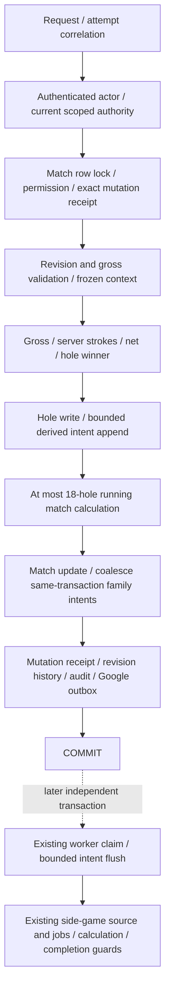

# Candidate synchronous score path

**PROVEN — SOURCE / isolated POSTGRESQL.** Migration121 changes score-origin branches of four installed trigger functions and inserts a durable seam. Core score function, golf calculations, actor/permission checks, revision/idempotency, match progress and finalization bodies remain byte-identical, verified in the installed catalog.

| Remaining work | Class / why before commit | Calls / scope | Lock / history | Failure effect |
|---|---|---|---|---|
| Runtime/admission/actor | SECURITY: valid authority and release fence | Existing current-pointer/exact actor checks | Shared admission; hosted certification not exercised by synthetic stub | Reject invalid write |
| Match/permission | SECURITY/CANONICAL | One match, one actor permission | Match `FOR UPDATE`; no history | Reject unauthorized/lifecycle write |
| Mutation lookup/hash | IDEMPOTENCY | Exact composite key | Same match lock | Replay or conflict |
| Context/course/tee/handicap | CANONICAL | Frozen snapshot/current participant rows (2 or4); hole1–18 | Exact keys | Reject invalid authority |
| Strokes/net/hole winner | CANONICAL | Fixed-size gross/participant arithmetic | No external side game | Reject invalid gross |
| Hole upsert/match progress | CANONICAL | One hole + maximum18 score rows | Match serialization | Complete rollback on error |
| Family intent append | AUDIT/DELIVERY, **not side-game calculation** | At most3 families, coalesced by tournament/match/transaction | Per-intent insert/unique conflict only; no processed-history lookup | Required durable demand failure correctly aborts score |
| Mutation/history/audit | IDEMPOTENCY/AUDIT | Bounded append | Index/FK locks; first-write activation latch only once | Required forensic write failure aborts |
| Google outbox | AUDIT/DELIVERY | Existing one canonical reporting event | Append/current generation | Required intent failure aborts, external provider failure later cannot |

See [inventory](SYNCHRONOUS-DEPENDENCIES.md) for every application/SQL function and [plans](QUERY-PLANS.md) for actual nested statements. One public score RPC is not one internal SQL statement. The intent table has primary/unique plus two partial indexes. One additional partial index excludes restored rehearsal history from the existing score-receipt guard; its exact predicate and security semantics are unchanged. No score-table indexes or timeouts changed.

Removed from the score transaction: Calcutta source construction, current-result/historical compatibility and job manipulation; Net Skins current-round source/hash/job materialization; five shared competition/intelligence job-row upserts. Those use existing consumers after commit. No Odds publication/calculator or leaderboard rebuild was present in the canonical score RPC; none is added.

Remaining derived-admission checks are narrow current facts: whether a feature is configured/auction exists, configured round, current generation/admission. Removing these would create invalid delivery scope. They do not compute the financial result. Final tournament close considers unresolved intents; emergency admission stop still works. Full annual-runtime/hosted close certification remains NOT PROVEN.

Standalone round/match controls keep their original synchronous derived hooks. Only a hole write and its same-transaction match update defer work, identified by the exact transaction/match COMPETITION intent. Consequently Calcutta/Net Skins/projection failure can still abort standalone Lock/Finalize; this candidate does not claim round-control isolation.
