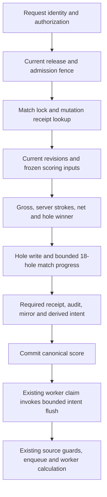

# Target canonical score architecture

Design recorded before migration 121 implementation and refined by scope review. Status: IMPLEMENTED AS AN ISOLATED CANDIDATE; owner architecture/deployment acceptance is not implied. Final migration SHA256: `cd9f6a784741d9e41c7f2e267bf4135549aeeb61333a22e4a31d9a174a3651a8`. Runtime proof and remaining failures are recorded separately in [certification](CERTIFICATION.md).

## Decision

Preserve the existing score RPC, response, revision-aware correction, authorization, match lock, canonical calculation, mutation receipt, audit and Google mirror intent. Replace synchronous Calcutta/Net Skins source construction and the five shared derived-job upserts only for score-origin changes with small durable invalidation intents. For those invocations, PostgreSQL AFTER-trigger work becomes bounded insertion/coalescing and current eligibility reads. Standalone match/round lifecycle invocations retain their original enqueue behavior.

The hole trigger establishes a COMPETITION intent before the score RPC updates the match. A later match trigger checks the exact tournament/match/transaction/family unique key; no caller flag or score-body change is needed. Actual score/Lock/Finalize/round trigger execution verifies the scope in [migration-safety evidence](evidence/migration-safety.json). The existing global writer-rehearsal guard also receives an exact-predicate partial index, based on measured restored-history growth; its rejection semantics stay unchanged.

## Durable seam

An intent identifies tournament, match, round, family, transaction and safe canonical revision metadata. Unique `(tournament, match, source transaction, family)` coalesces the hole and match trigger within one transaction. It has no financial payload or alternative score authority. Different matches do not update the same intent row.

Families are CALCUTTA, NET_SKINS and COMPETITION. The latter represents the existing five projection engines; Odds publication itself remains owner-controlled and unchanged. Intent creation failure aborts the score: losing durable notification would violate the promised architecture. Worker failure cannot retroactively abort a committed score.

This is a deliberate minimal adaptation, not literal completion of postmortem BE-JOB-001's single event with all independent consumer checkpoints. The candidate uses up to three family rows; five engine jobs follow one COMPETITION materialization checkpoint; Google retains its separate required transactional outbox. Atomic durable invalidation and family retry are provided, while a unified event identity and all-consumer checkpoint architecture remain a review decision. Multiple canonical calls in one transaction coalesce to latest match/family provenance; their individual mutation receipts remain canonical.

Existing authenticated worker claim functions flush at most eight pending intents for their family before their unchanged claim logic. No new public RPC or transport contract is needed. Current-authority enqueue and intent acknowledgement commit together. A lost worker response leaves either both or neither committed. Existing source/configuration/current-pointer and lease completion checks remain authoritative.

Durable demand supports at-least-once processing attempts when consumers run; autonomous delivery is not yet proven. Reprocessing uses current canonical facts and existing source fingerprint deduplication. An old intent cannot publish its stored revision as a new result. Attempts, safe SQLSTATE, backoff and dead-letter status remain visible. Pending/dead-letter intents block final annual close. Emergency scoring admission closure remains available; intent materialization pauses until compatible authority reopens and no pending intent is discarded. Close uses the existing exclusive admission lock; scoring and workers retain its shared counterpart.

## Semantics requiring proof

- Calcutta previously exposed an older published result with `stale=true/updating=true` after enqueue. The implemented candidate adds pending/retryable intent existence to `updating`, preserving the existing source freshness comparison and response shape. Actual claim/calculation/completion tests verify stale completion rejection. DEAD_LETTER does not pretend that work is still updating; full Official publication lifecycle remains unproven.
- Net Skins must retain current source equality for Official results and transition to IN_PROGRESS for changed golf, even with delayed enqueue.
- The annual close certificate must include unresolved intents; retaining only the old job checks would be unsafe.
- Compatible deployment changes may consume old intents using current authenticated runtime authority. An obsolete tournament/generation must fail closed, not be silently rebound.
- The existing supported revision-aware correction is retained. “No silent overwrite” means stale concurrent requests conflict and accepted corrections retain before/after audit; this phase does not introduce append-only scoring.

## Explicit unresolved worker boundaries

Migration-safety tests prove a mixed-round Net Skins advisory-lock cycle can produce `40P01`. The handler automatically saves a RETRYABLE intent and backoff; a later fresh claim processes it, with canonical state unchanged. This is understood recoverability, not deadlock elimination. No automatic timer is created by `available_at`; independent scheduling, cached EMPTY-claim avoidance, dead-letter recovery and hosted resource headroom remain unresolved.

Actual future annual Calcutta, competition and intelligence claim initializers still raise pre-existing `42883` errors. The candidate does not repair those paths. Annual manifest execution on the isolated schema is proven; hosted active-generation admission, annual worker execution and annual scoring overhead are not. Existing annual certifications deliberately prevent installation until separately reviewed, so there is no silent rebinding or deployment authorization.

## Alternatives rejected

Retaining Calcutta/Net Skins enqueue inside score transactions leaves source aggregation and historical compatibility reachable. Keeping five shared projection rows in each score transaction preserves a tournament-wide contention point. Fire-and-forget application work loses durable demand on process death. A new independent queue service is unnecessary: PostgreSQL intents plus existing claim processors provide the smallest durable seam.

No timeout increase, golf formula change, authorization weakening, direct score-table API, native implementation or Production operation is part of this design. See [invariants](SCORE-INVARIANTS.md), [dependencies](SYNCHRONOUS-DEPENDENCIES.md) and [transaction boundary](TRANSACTION-BOUNDARY.md). Runtime acceptance is recorded separately in [certification](CERTIFICATION.md).
