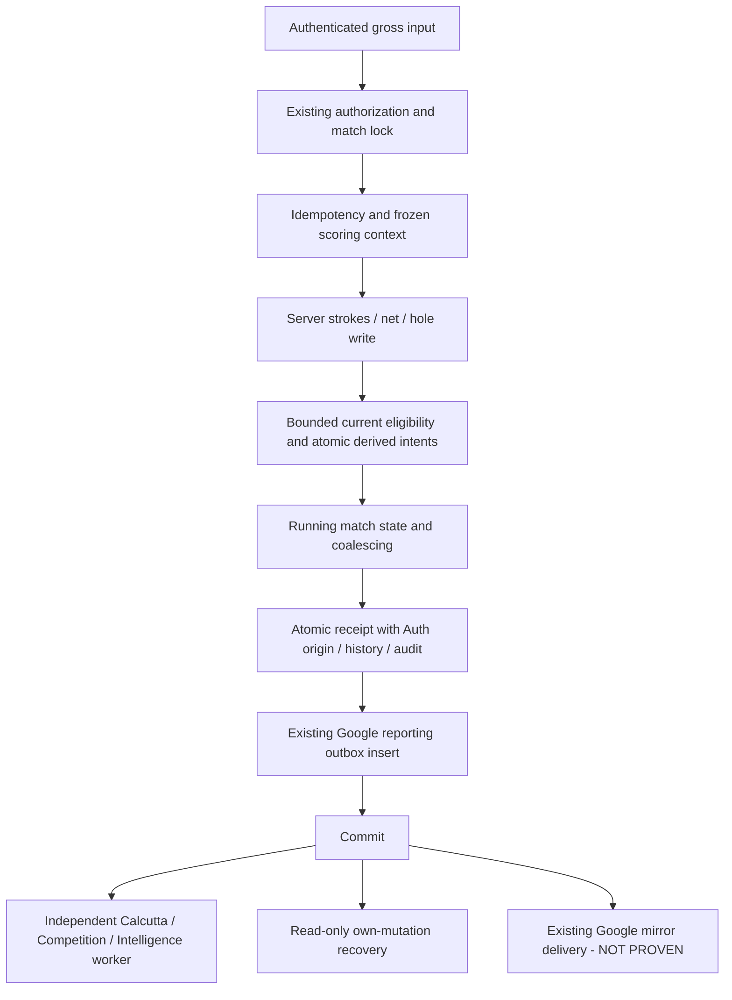

# Score path and scope after Phase 2C

**PROVEN SOURCE**: ordinary canonical golf rules remain unchanged. Migration122 adds immutable originating identity to the existing atomic receipt insert. Migration123 changes derived lock acquisition and annual SQL/manifest integration. Migration124 changes derived queue delivery only. No shipping native file, formula, course/tee/handicap authority or financial calculator was changed.

Scoring retains three small derived-authority reads solely to determine durable-intent eligibility: current Calcutta pointer, current NetSkins config pointer, and that exact config revision. Each is an indexed exact/current lookup; at most the three configured rounds are inspected. Do not describe this as zero side-game reads. Historical compatibility, calculators, result publication and independent worker success are outside score commit.

Recovery uses exact receipt identity and immutable original actor plus verified current participant identity/membership. It has no scoring permission grant, row-write lock, or inferred match-score provenance. Missing, in-flight, legacy-unbound and other-actor receipts return UNKNOWN. COMMITTED returns the original acknowledgement even after an authorized later correction.

Derived intent SUCCEEDED means demand was materialized, not that every derived result is current. Certification separately checks jobs, current pointers, source fingerprints and unchanged calculator outputs. Automatic private Calcutta/projection recalculation does not authorize financial ownership changes or public publication. NetSkins calculation remains owner initiated.

[Query plans](QUERY-PLANS.md) and [proof matrix](PROOF-MATRIX.md) state the measured bounds and unproven layers. No Production performance conclusion follows from this diagram.

## All durable work, including the legacy mirror

The existing Google reporting outbox remains required atomic durability inside the score transaction. Its external write is post-commit. It is a separate automatic work class when admitted, not an owner-approved financial job. The new worker does not consume it, and the full-sequence zero-intent assertion only covers the three new automatic families. Its delivery/retry/terminal recovery and mirror-only lifecycle semantics remain an unresolved Phase2C P0-B gate; see [exact source review](GOOGLE-OUTBOX-GAP.md).

Finalize additionally records the existing scorecard archive snapshot/job. This is a control-transition obligation, not an ordinary hole-score event. Archive external delivery is listed separately and NOT PROVEN. No current Production flags/scheduler configuration were inspected or inferred. These omissions prevent overall Phase2C PASS despite the completed three-family local proofs.
