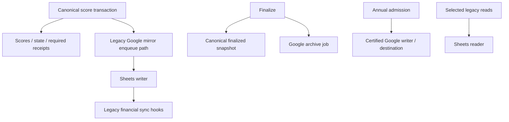
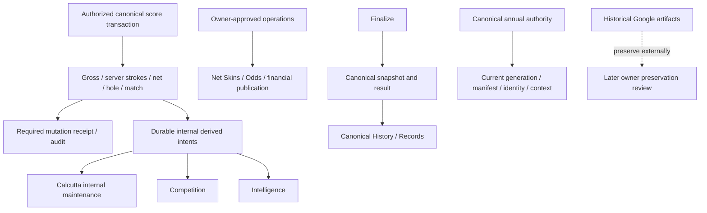

# Candidate architecture

**PROVEN — SOURCE:** before retirement, canonical Supabase/PostgreSQL golf authority coexisted with selectable legacy Google reads/writes, score mirror outbox, finalized-snapshot archive delivery, future-match writer admission, Odds mirror, Guide synchronization and Google-dependent runtime/release checks. Google score mirroring could call legacy Net Skins synchronization and Calcutta publishing. This establishes coupling, not proof of actual historical financial corruption.

Candidate runtime after transport removal (required replacement gaps remain below):

Google transport is disconnected in the candidate. Historical Google delivery rows remain preserved evidence and are excluded from current Google delivery requirements; no consumer silently drains them after retirement. Remaining internal consumers reuse the existing durable delivery infrastructure. No outbox replacement or new events were introduced.

**PROVEN GAP / incomplete replacement:** the isolated Director UI previously selected the Google dashboard. Existing Production console APIs are canonical but Production-bound. No spoofed Production environment is an acceptable Preview replacement. Actual annual CREATE also fails the current-year/target-year protocol, despite the removal of Google gates. See [CLIENT-COMPATIBILITY.md](CLIENT-COMPATIBILITY.md), [ANNUAL-INITIALIZATION.md](ANNUAL-INITIALIZATION.md), and [CERTIFICATION.md](CERTIFICATION.md) before any claim of complete retirement.

Runtime retirement, external artifact preservation, credential revocation and backup restoration are separate decisions. No real external action was performed.
